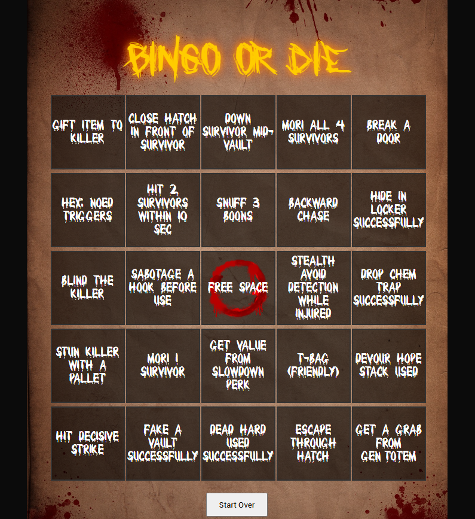

# DBD Bingo Widget

A custom Twitch overlay widget designed for *Dead by Daylight* bingo games. Perfect for streamers who want to add chaotic, creepy fun and viewer interaction to their broadcasts.

## 🧩 Features

- Killer, survivor, and action-based bingo modes
- Works natively as a browser source in OBS
- Custom title input
- Click-to-stamp cells with blood splatter effect
- Sound and visual effects for stamped squares and completed bingos

## 🎮 How to Use

1. Open `index.html` in your browser or host it somewhere.
2. In OBS, add a **Browser Source** and point it to the hosted file (or local file with `file:///` path).
3. Choose your bingo mode, enter a title, and hit **Start Game**.
4. Click on cells to mark them as completed.

## 🎨 Assets Used

All assets (fonts, audio, images) are included in the `assets/` folder:
- Custom fonts (`Title.ttf`, `Grid.ttf`, `UI.ttf`)
- Background: `blood-splatter-background.jpg`
- Cell overlay: `blood-splatter-frame.png`
- Audio: `stamp.ogg`, `bingo.mp3`

## 🛠 Customize

You can edit the `pools` object in the HTML `<script>` section to change bingo content. Add your own categories, items, or adjust difficulty.

## 📜 License

This project is licensed under the [MIT License](LICENSE).

## 🧙‍♀️ Credits

Made by [witchcraftscripts](https://github.com/witchcraftscripts) with design inspiration from the Entity themself.
